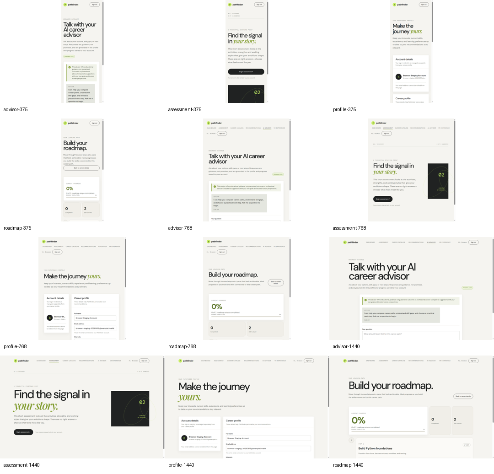

# Frontend Phase 3 Responsive Evidence

This document records the authenticated responsive verification completed for Frontend Phase 3. The checks were performed against the approved staging frontend using a synthetic browser account and a controlled Chromium DevTools Protocol capture. No production credentials or personal data were used.

> The captured routes are assessment, profile, advisor, and the AI Engineer roadmap at 375px, 768px, and 1440px viewport widths. The evidence covers the authenticated learning-flow layout only; it does not claim Firefox, Safari/WebKit, Edge, touch-device, VR-target-hardware, or WebXR headset support.

## Test matrix

| Route | 375px mobile | 768px tablet | 1440px desktop | Result |
|---|---:|---:|---:|---|
| `/assessment` | Captured | Captured | Captured | Pass: readable hero, action control, and progress content without visible horizontal overflow |
| `/profile` | Captured | Captured | Captured | Pass: stacked mobile form, tablet account/profile cards, and wide desktop form remain readable |
| `/advisor` | Captured | Captured | Captured | Pass: heading, guidance panel, conversation content, and question area preserve usable flow |
| `/careers/career_ai_engineer/roadmap` | Captured | Captured | Captured | Pass: progress summary, metrics, navigation control, and roadmap cards remain visible and readable |

## Observations

At **375px**, the authenticated pages use a vertical layout. The assessment heading and explanatory copy wrap naturally, the primary action expands to a usable full-width control, the profile cards stack, the advisor guidance content remains readable, and the roadmap progress summary and metrics fit within the viewport. The pages continue below the fold as expected rather than clipping content horizontally.

At **768px**, the tablet navigation occupies its own readable row and the account controls remain accessible below it. The assessment hero retains a stable two-column composition, while the profile account and career-profile cards remain side by side with usable field widths. No visible horizontal overflow was observed in the captured assessment or profile states.

At **1440px**, the advisor page preserves its wide reading composition with the guidance banner, conversation panel, and question area visible. The roadmap page presents the progress summary, completion metrics, back-to-career control, and roadmap step card in a stable desktop arrangement. No visible clipping or horizontal overflow was observed.

## Evidence artifact

The full capture set is included in the repository under `docs/assets/`. The contact sheet below provides a compact overview of all twelve route-and-viewport combinations.

The individual images follow the naming convention `{route}-{viewport}.png`, where the viewport is `375`, `768`, or `1440`.

## Scope and limitations

This evidence closes the authenticated responsive Phase 3 item for the staging environment. Browser-engine coverage beyond Chromium remains pending because Firefox, Safari/WebKit, and Edge were unavailable in the execution environment. Touch interaction, target-device VR performance, and WebXR headset entry/exit remain hardware-gated and are not marked complete. Controlled server-failure simulations remain separate from this responsive evidence and are not claimed here.
